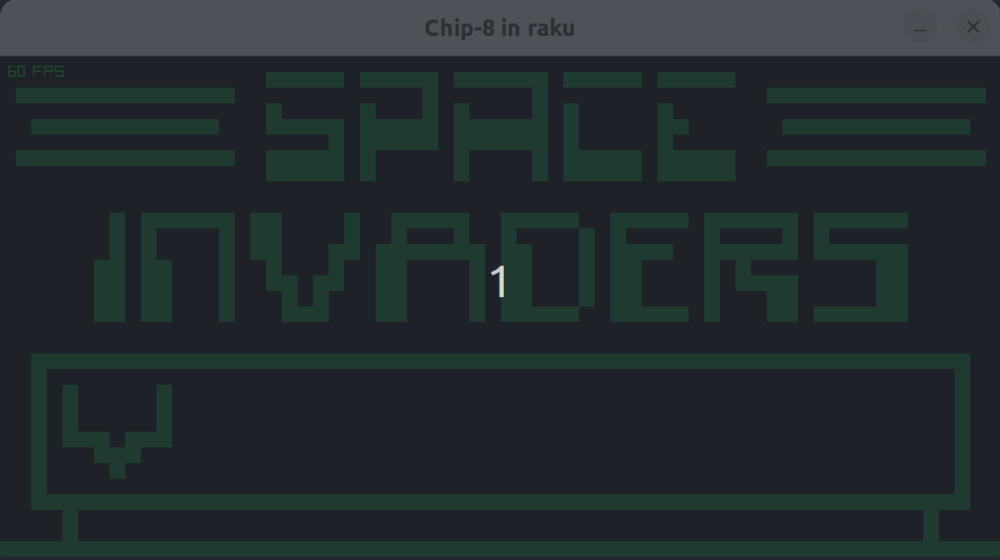

# Chip-8 emulator in raku.

Raku comes with useful constructs such as buf8, buf16 and unsigned integer which are nice when working on an emulator.

To play run
```
raku main.raku roms/space_invaders.ch8
```


To render I used Raylib::Bindings https://github.com/vushu/raylib-raku

- Still missing sound implementation.